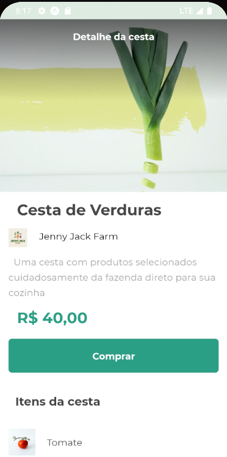

</br>

<p>PROJETO EM REACT-NATIVE</p>
<p>Utilizando Expo</p>
<hr>
</br>
    <h3 aling="center"> Projeto realizado seguindo aulas!</h3>
    <p> Projeto que representa uma cesta de compras </p>
    </br>
    <P> Este projeto contém </p>
    <ul>
        <li> Tela de listagem itens </li>
    </ul>
    
</br>
    
</br>
</br>

### 🎲 Rodando o Front 

```bash
    # Clone este repositório  
    $ git clone <https://github.com/KayoSilva19/App-Cesta-Carrinho-Compras>

    # Acesse a pasta do projeto no terminal/cmd
    $ cd orgs-cesta

    $ npm install
    
    # Com o React-Native instalado execute o projeto
    $ npm start
```